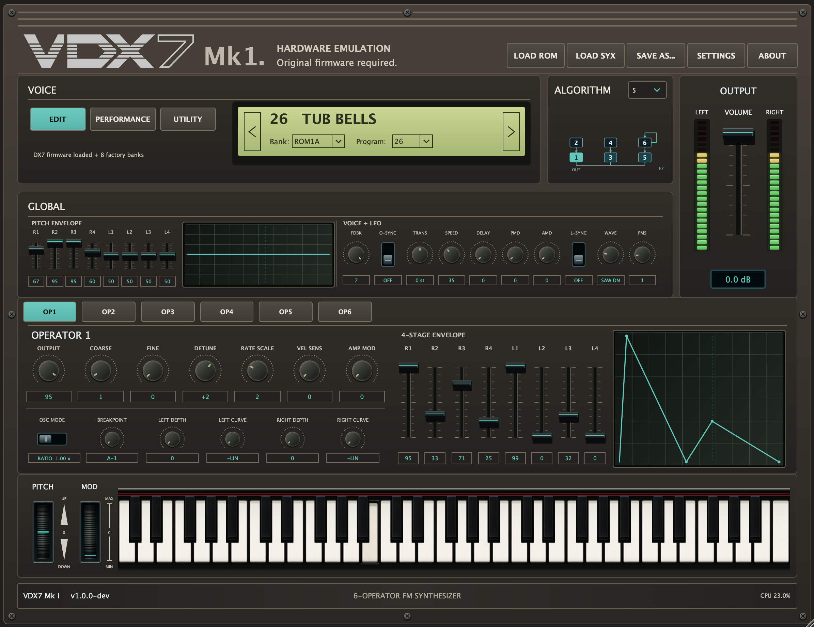
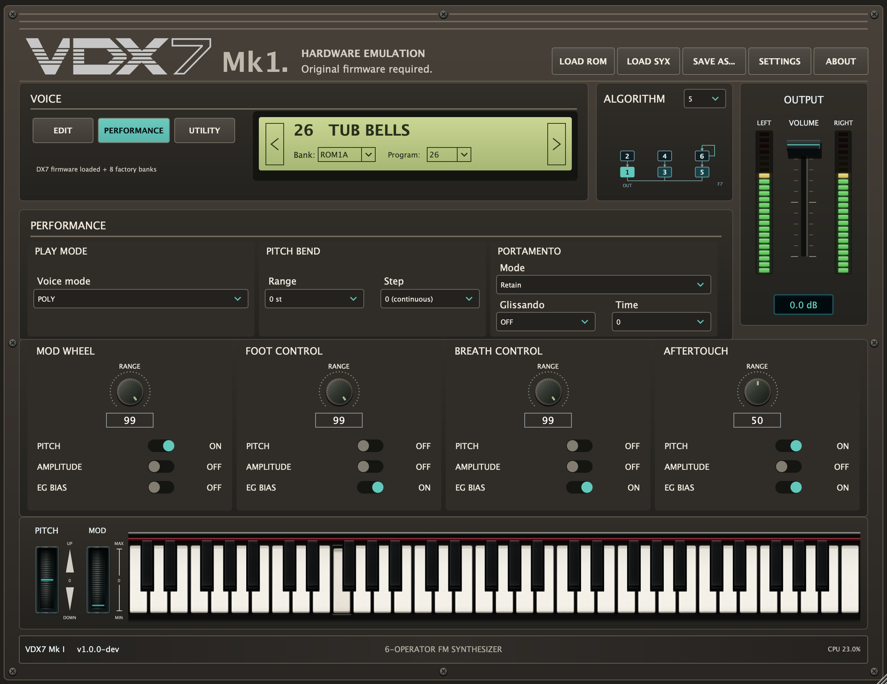
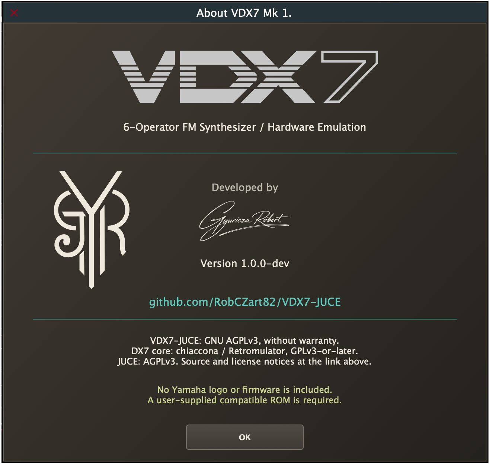

# VDX7 Mk1.

**6-Operator FM Synthesizer · Hardware Emulation**

An open-source instrument built around the VDX7 DX7 Mk I hardware-emulation
core, its portable Retromulator dx7Lib adaptation and JUCE.
Original firmware, a hardware-inspired interface and hands-on voice editing.

[Magyar](README_HU.md)

> **1.0.0-dev — development preview.** The GUI design is owner-approved;
> full release acceptance is still in progress. A compatible, legally obtained
> user-supplied ROM is required. No Yamaha firmware or factory voice data is included.

*Actual 1.0.0-dev screenshots supplied by the project owner. The owner approved
this GUI after testing the local VST3 in REAPER and the Standalone app.
The screenshots retain their development labels; they are not a stable-release certification.*

## Download

Development VST3 builds are available from [GitHub Actions](https://github.com/RobCZart82/VDX7-JUCE/actions).
Choose a successful run for the desired branch and commit, then download its artifact:

- **Windows x64:** `VDX7-Windows-x64-VST3`
- **macOS Universal (Apple Silicon + Intel):** `VDX7-macOS-universal-VST3`

GitHub sign-in may be required to download artifacts. Use the latest successful
**main** run for the merged version; a pull-request build can contain changes
that are not yet on main. Artifacts are temporary development downloads, not
a published 1.0.0 release.

[Published releases](https://github.com/RobCZart82/VDX7-JUCE/releases) are separate
from these test builds. Standalone and macOS AU are source-build targets;
the public workflows currently distribute VST3.

## Features

- Six FM operators, 32 algorithms and a selectable operator-routing diagram.
- Per-operator four-stage envelopes, ratio/fixed frequency, detune and keyboard scaling.
- Global pitch envelope, feedback, oscillator sync and LFO controls.
- PERFORMANCE page with POLY/MONO, pitch-bend range/step and portamento.
- Mod wheel, foot controller, breath controller and aftertouch assignments.
- DX7 single-voice/bank SysEx import/export and a persistent 32-slot USER bank.
- 148 host automation parameters and DAW project-state recall.
- EDIT/PERFORMANCE views, on-screen keyboard, pitch/mod wheels, output meters
  and audio-callback CPU display.
- Proportional GUI size choices: 50%, 75%, 100%, 125% and 150%.

## System requirements

A matching VST3 host is required for the plug-in. Build targets are **Windows x64**
and **macOS Universal**; macOS 11 is the deployment target, not a guarantee that
every OS/host combination has been tested. Physical Intel Mac and Windows host
acceptance remain release gates. Standalone runs without a DAW when built locally.

**A compatible DX7 Mk I ROM is required for sound.** Supported layouts and
optional external factory-bank data are described in the
[firmware guide](docs/guides/GUIDE_EN.md#3-firmware-and-banks).
Supported MIDI notes are **12–120** in both Native and Correct MONO modes.

Users of prebuilt artifacts do not need a compiler or CMake. Development packages
are not notarised/Developer ID signed; see the guide before responding to OS prompts.

## Installation

1. Close your host and back up the existing plug-in, projects and edited banks.
2. Extract the downloaded artifact and any enclosed ZIP; copy the complete
   `VDX7.vst3` bundle to your VST3 location:
   - macOS: `~/Library/Audio/Plug-Ins/VST3/`
   - Windows: `C:\Program Files\Common Files\VST3\`
3. Rescan plug-ins in your host and load VDX7 as an instrument.
4. Use **LOAD ROM** to select your legally obtained compatible firmware.
5. Select a program or load a compatible SysEx file, enable MIDI monitoring and play.

Avoid duplicate plug-in installations. Never disable system-wide security protections.
See [first sound and firmware setup](docs/guides/GUIDE_EN.md#2-installation-and-first-sound).

## Documentation

- [Documentation index and archive](docs/README.md)

- [Detailed English guide](docs/guides/GUIDE_EN.md)
- [Magyar útmutató](docs/guides/GUIDE_HU.md)
- [1.0 release checklist and remaining acceptance work](docs/release/ROADMAP_1.0.md)
- [Source dependencies](docs/guides/SOURCE_DEPENDENCIES.md)
- [License and third-party notices](NOTICE.md)

No live MIDI Out/SysEx transmission is implemented. Envelope graphs illustrate
shape rather than calibrated timing. Full firmware, offline-render, automation
and cross-platform acceptance must not be inferred from GUI approval or green CI.
See [known limitations](docs/guides/GUIDE_EN.md#9-known-limitations).

## Building from source

See [Building from source](docs/guides/GUIDE_EN.md#11-building-from-source) for C++20,
CMake 3.22+, platform tools, pinned dependencies and test commands.
Public CI runs ROM-free regressions; firmware-dependent tests require a legally
available local ROM that must never be committed or packaged.

For bug reports, include the build/commit, OS, architecture, host version,
sample rate/buffer and reproduction steps in
[GitHub Issues](https://github.com/RobCZart82/VDX7-JUCE/issues).

## About

*Actual 1.0.0-dev About window supplied by the project owner.*

Developed by **RobCZart82**. Thanks to
[chiaccona / VDX7](https://github.com/chiaccona/VDX7),
[Retromulator / dx7Lib](https://github.com/reales/retromulator)
and [JUCE](https://github.com/juce-framework/JUCE).
VDX7-JUCE is not a Dexed-based reimplementation.

## License

The wrapper and original GUI resources use [GNU AGPL-3.0-only](LICENSE.txt).
The DX7 core retains GPL-3.0-or-later and JUCE is used under AGPLv3;
see [notices](NOTICE.md). Provided without warranty.

Yamaha firmware is excluded. Yamaha is referenced only to identify compatibility;
this project is not an official Yamaha product and includes no Yamaha logo.
