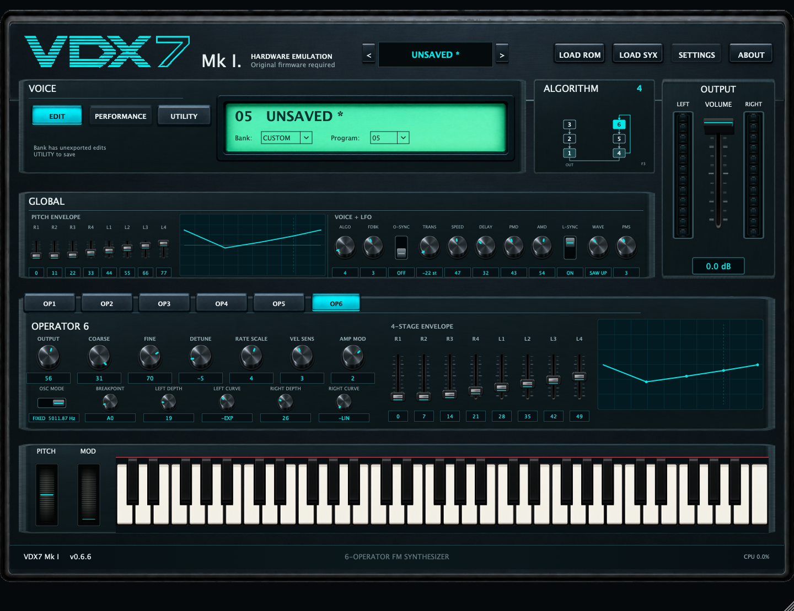

# VDX7-JUCE v0.6.6 Pre-Beta 2

[English documentation](README.md)



A VDX7-JUCE hatoperátoros FM hangszer, a VDX7 DX7 Mk I hardveremulációs magjára, annak hordozható Retromulator dx7Lib adaptációjára és JUCE-ra építve. Nem Dexed-alapú újraimplementáció.

**Tesztelésre szánt előzetes kiadás, nem kész hangszer.** A kezelőfelület már jelentősen kidolgozott, de több funkció és ellenőrzés még hiányzik. Frissítés előtt készíts projektmentést, és exportáld a fontos módosított bankokat.

## 1. Platform és csomag

Az előkészített bináris **macOS Apple Silicon (arm64), VST3**. Natív Apple Silicon hostban használd; nem Intel/Universal bináris. Az AU és Standalone cél helyben lefordul, de nem ezek az elsődleges kiadási csomagok. Windows- és Universal-build scriptek vannak, ezek nem ellenőrzött kiadási binárisok.

A bináris ad-hoc aláírt, nem Developer ID aláírt és nem notarizált. A macOS jóváhagyást kérhet. Ne kapcsold ki a rendszer egészére vonatkozó biztonsági védelmeket. A macOS 11 a build script célverziója, nem minden rendszer/host kombináció tesztelésének ígérete.

## 2. Telepítés és első megszólaltatás

1. Zárd be a hostot, és mentsd a meglévő VDX7 plugint és projekteket.
2. Csomagold ki a VST3 ZIP-et, és a teljes VDX7.vst3 csomagot másold ide:
   `~/Library/Audio/Plug-Ins/VST3/`
3. REAPERben indíts újrakeresést a Preferences → Plug-ins → VST alatt, majd illeszd be a VDX7-et virtuális hangszerként.
4. Add meg saját kompatibilis firmware-edet a LOAD ROM gombbal vagy az alábbi automatikus keresési helyek egyikén.
5. Válassz bankot/programot az LCD-n, vagy importálj megfelelő .syx fájlt a LOAD SYX gombbal.
6. Játssz MIDI hangokat, vagy használd a képernyő-billentyűzetet.

Ha nincs hang, ellenőrizd a firmware állapotát, a MIDI útvonalát, a sáv monitorozását és az OUTPUT hangerőt. Kerüld a párhuzamos VDX7-példányokat a felhasználói és rendszerszintű pluginmappákban.

## 3. Firmware és bankok

**Yamaha firmware és gyári hangadat nincs mellékelve.** Csak olyan fájlokat használj, amelyek használatára jogosult vagy; a projektmentés nem csomagolja be a firmware-t.

Elfogadott ROM-elrendezések:

- 16 384 bájtos DX7 Mk I firmware, opcionálisan mellette `dx7_factory_voices_32KB.bin`.
- 49 152 bájtos kombinált `dx7.bin`: 16 KB firmware és 32 KB gyári hangadat.

Automatikus keresési mappák:

| Rendszer | Helyek |
| --- | --- |
| macOS | `~/Library/Application Support/VDX7-JUCE/ROM/`, `~/Library/Application Support/discoDSP/Retromulator/ROM/` |
| Windows forrásból fordítva | `%USERPROFILE%\Documents\VDX7-JUCE\ROM\`, `%USERPROFILE%\Documents\discoDSP\Retromulator\ROM\` |

Gyári hangadat esetén ROM1A–ROM4B érhető el: nyolc bank, bankonként 32 program. Enélkül kompatibilis hangszín-/bank-SysEx adat szükséges. A LOAD ROM kézi fájlválasztást is biztosít.

## 4. Hangszínszerkesztés

- Hat operátortab: kimeneti szint, durva/finom hangolás, detune, rate scaling, velocity- és amplitúdómoduláció-érzékenység.
- OSC MODE vízszintes kapcsoló: RATIO vagy FIXED, alatta névleges arány/Hz. A kijelzés nem tartalmazza a detune és moduláció hatását.
- Operátor-envelope: operátoronként négy Rate és négy Level.
- Keyboard scaling: töréspont, bal/jobb mélység és négy görbetípus.
- GLOBAL: négyszakaszos pitch envelope, 1–32 algoritmus, feedback, oszcillátor-szinkron, transzponálás és LFO-vezérlők.
- LFO: sebesség, késleltetés, pitch/amplitude modulációmélység, szinkron, hat hullámforma és pitch-moduláció-érzékenység.
- A grafikonok a burkológörbe alakját szemléltetik; nem kalibrált idő-/félhangdiagramok.

## 5. Algoritmusábra és játékvezérlők

Mind a 32 algoritmus kapcsolása látható. Operátorcsomópontra kattintva kiválasztod annak szerkesztőjét; a tabok és az ábra kijelölése együtt mozog. A kijelölés nem némít operátort és nem módosít hangot. Az OUT a kimeneti operátorokat jelöli; az F0–F7 a feedback értéke, nem élő jelszint.

A képernyő-billentyűzet, a középre visszatérő pitch kerék, a helyzetét megtartó modulation kerék és a hangerőfader működik. A kerék bordázata az értékkel együtt mozog. A két kivezérlésmérő a kimeneti szintet mutatja; a mag mono jele mindkét csatornára kerül.

A footer CPU-százaléka simított audio-callback terhelésbecslés, nem a teljes számítógép CPU-használata, és nem feltétlenül egyezik a REAPER mérőjével.

## 6. Utility és SysEx

A UTILITY menüben hangszínátnevezés (1–10 nyomtatható ASCII karakter), egyhangszínes export, bankexport és operátormásolás/-beillesztés található. A másolás mind a 21 operátormezőt tartalmazza. Vágólapja a pluginpéldányhoz tartozik, a projekt nem tárolja.

A LOAD SYX egy teljes DX7-hangszínt (163 bájtos VCED) vagy bankot (4104 bájtos VMEM) fogad. Egy hangszín a kijelölt helyet, egy bank a szerkeszthető bankot cseréli le. Összefűzött dumpok és más hangszertípusok formátumai nem támogatottak. Importkor szerkezet- és checksum-ellenőrzés történik. Az export device/channel nibble értéke 0; az import 0–15 értéket fogad.

## 7. Mentés és automatizálás

148 host-paraméter érhető el: 145 hangparaméter és Master Volume, Pitch, Mod. A korábbi paraméterazonosítók és sorrendjük megmaradtak.

A projekt szerkeszthető RAM-ot, bank-/programállapotot, ROM-útvonalat és vezérlőállapotot tárol. Projektköltöztetés után is legyen elérhető a külső ROM. A programváltás bezárt szerkesztőablaknál is szinkronizálja a paramétereket.

A név melletti csillag nem exportált módosítást jelez. A DAW-projekt mentése és a SysEx-export külön művelet: a projektmentés nem törli az exportjelzést. Az egyhangszínes export egy hangot, a bankexport minden helyet nyugtáz.

Kézi bank-/ROM-/SYX-csere előtt figyelmeztetés jelenik meg a nem exportált módosításokra. MIDI-vezérelt bankváltás nem nyit párbeszédablakot, és lecserélheti a bankot: előtte exportáld a fontos módosításokat. A jelzés nem visszavonási előzmény.

## 8. A kezelőfelületi mérföldkő újdonságai

A v0.6 sorozat kattintható algoritmusábrát, mechanikus kerékgrafikát, OUTPUT fadert, LCD-be épített bank-/programválasztókat, kétállású szinkronkapcsolókat, jobb billentyűkontrasztot/piros filcet, teljes keretet kitöltő envelope-rácsokat és finomított elrendezést hozott. A v0.6.6-ban enyhébb a tekerők hover-kiemelése, vízszintes az OSC MODE összevont kijelzéssel, és szorosabb a presetváltó elrendezése.

## 9. Ismert korlátok

- A PERFORMANCE és SETTINGS oldal még nincs megvalósítva.
- Élő MIDI Out/SysEx-küldés nincs; SysEx-fájlimport/-export van.
- A mintavételi frekvencia átalakítása jelenleg lineáris interpolációt használ; minőségi fejlesztése tervben van.
- A hangparaméterek módosítása újratölti az aktív programot. Sűrű automatizálás és tartott hang alatti szerkesztés további hosttesztet igényel.
- A hardveres és más szoftverekkel való SysEx-együttműködés nincs átfogóan ellenőrizve.
- Nem ígér teljes DX7-funkcióazonosságot, kalibrált envelope-időzítést vagy általános hostkompatibilitást.
- A fontos munkáról készíts biztonsági mentést; a pre-beta nem jelent produkciós stabilitási garanciát.

## 10. Ellenőrzés és hibajelentés

A helyi Apple Silicon VST3/AU/Standalone fordítások és ad-hoc aláírás-ellenőrzések sikeresek. Az automatizált tesztek hangadatot, SysEx-et, állapot-visszatöltést, korábbi paramétersorrendet, algoritmuskapcsolásokat, kapcsolóbekötéseket és három méretben a vezérlők elhelyezését ellenőrzik. Az offline hang 44,1/48/96 kHz-en, 64/128/256 mintás pufferekkel véges és nem néma volt.

Korábbi változatokat a felhasználó REAPERben tesztelt. Ezek az ellenőrzések nem jelentenek teljes v0.6.6 hostminősítést. Kérjük, próbáld ki az újraindítás utáni preset-visszaállítást, automatizálást, tartott hangokat, kapcsolókat és átméretezést.

Hibát a [GitHub Issues](https://github.com/RobCZart82/VDX7-JUCE/issues) oldalon jelezz verzióval, operációs rendszerrel, CPU-architektúrával, host/verzióval, mintavétellel/pufferrel, lépésekkel és elvárt/tényleges eredménnyel. Szükség esetén mellékelj képet vagy minimális projektet; jogvédett ROM-ot ne tölts fel.

## 11. Fordítás forrásból

Szükséges: C++20 fordító, CMake 3.22+, macOS-en Xcode/Command Line Tools. A függőségek verziója rögzített; a teljes forrás ZIP tartalmazza a JUCE-ot és dx7Lib-et offline fordításhoz. A sima Git checkout letölti ezeket. Lásd: [forrásfüggőségek](SOURCE_DEPENDENCIES.md).

Fordítás a telepített plugin felülírása nélkül:

```sh
cmake -S . -B build-local -G Xcode -DCMAKE_OSX_ARCHITECTURES=arm64 -DCMAKE_OSX_DEPLOYMENT_TARGET=11.0
cmake --build build-local --config Release --target VDX7_VST3
```

Kimenet: `build-local/VDX7_artefacts/Release/VST3/VDX7.vst3`.

A kényelmi `scripts/build-macos-arm64.command` script a telepített felhasználói VST3-at is lecseréli; előtte mentsd azt. Universal- és Windows-segédek: `scripts/build-macos-universal.command`, `scripts/build-windows.bat`. A macOS GitHub Actions workflow Universal artifactot fordít; a sikeres build nem hostellenőrzés.

Tesztek:

```sh
cmake --build build-local --config Release --target vdx7_voice_data_tests vdx7_algorithm_tests vdx7_processor_tests
ctest --test-dir build-local -C Release --output-on-failure
./build-local/Release/vdx7_processor_tests
```

A processor teszt helyben felismerhető ROM-ot igényel (hiányában 77-es kilépés), nem nyit audioeszközt, és opcionálisan egy létező abszolút mappát fogad a PNG-előnézetekhez.

## 12. Licenc és kiadási állapot

Ez a kiadás [GNU AGPLv3](LICENSE.txt) szerint érhető el. A wrapper és az eredeti GUI-erőforrások AGPL-3.0-only licencűek; a DX7-mag megőrzi GPL-3.0-or-later licencét és eredeti közléseit. A JUCE-ot AGPLv3 alatt használjuk. Az egyesített mű és a komponensek közlései: [NOTICE.md](NOTICE.md).

A kiadás a bináris mellett teljes forrást biztosít a rögzített JUCE- és dx7Lib-forrással, build scriptekkel és licencközlésekkel. A szoftver garancia nélkül érhető el. A firmware nem része a szoftverlicencnek. A leírásban szereplő Yamaha-név kompatibilitást jelöl, nem támogatást vagy jóváhagyást; Yamaha-logó nincs mellékelve.

## 13. Köszönet és következő lépések

Köszönet a [VDX7/chiaccona](https://github.com/chiaccona/VDX7), [Retromulator/dx7Lib](https://github.com/reales/retromulator) és [JUCE](https://github.com/juce-framework/JUCE) fejlesztőinek. Csak a hordozható DX7-mag épül be, nem a teljes Retromulator alkalmazás.

Következő prioritások: szélesebb hosttesztelés, Performance/Settings funkciók, tartott hangok alatti szerkesztés és a resampling/hangminőség vizsgálata.
